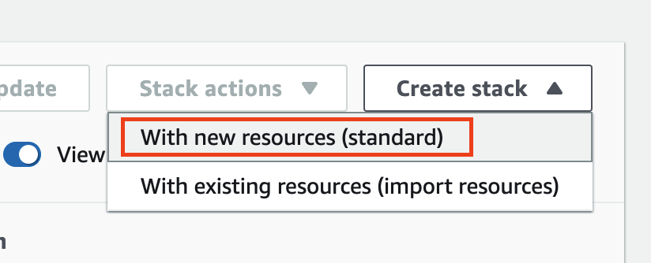

# CloudEndure Blueprint Automation
The tools and scripts provided in this repo can be used to automate the setting and updating of blueprints in CloudEndure. 

## How it works


1. A CloudFormation template is used to spin up infrastructure (EC2) as part of that deployment a custom resource is used to  insert the blueprint setting into a DynamoDB table.
2. The DynamoDB table contains all the blueprints that are managed by the solution. The table serves as the source of truth of the solution.
3. The DynamoDB table has a stream that feeds any newly created or changed items to a lambda function.
4. The updater lambda function is triggered by the DynamoDB stream. It looks for new or changed items and formats that data into a configuration request. The request is then sent to an SQS Queue.
5. A configuration queue feeds the configurator function.
6. The configurator function receives messages form the configurator queue then reaches out to CloudEndure to set the blueprint.
7. Because changes can occur out side of this process (e.g. changes made directly in CloudEndure console), the sync function compares blueprint settings in CloudEndure and the DynamoDB table. If differences are found the settings in the  DynamoDB table are applied.
8. The sync function is run on a scheduled interval using a CloudWatch event rule configured as desired (24 hours default)
<hr>

# Usage

## Backup Blueprints
Before starting the deployment of the solution, Its is advisable to create a backup of all the blueprints as they are currently set in CloudEndure. A script has been provided for this purpose in the scripts folder of this repo. 

Follow the instructions below to create a backup.

### Prerequisites
<details>
    <summary><strong>Python 3.6+</strong></summary>
The backup script was developed for Python 3.6 or later. To install python on your workstation follow the instructions for your OS below:
- Instructions for [Windows](https://www.python.org/downloads/)
- Instructions for [Linux](https://docs.python-guide.org/starting/install3/linux/)
</details>

<details>
    <summary><strong>CloudEndure API Token</strong></summary>
Before backing up the blueprints in your CloudEndure account you will need obtain your User API token. The process to get this token is described below.

1. Log into the CloudEndure console at [console.cloudendure.com](console.cloudendure.com)
2. Navigating to Setup & Info > OTHER SETTINGS > API Token
3. If a key was not previously generated, Click on GENERATE NEW TOKEN to generate a new API Token. If a token exists you can use it or generate a new one.
</details>

**Use the script**
1. Open your shell window and navigate to the folder containing the script.

2. Run the following command to create the backup
``` shell
python3 backup_all_blueprints.py --user-api-token "<<TOKEN>>" --file-name "ce_backup.csv"
```

## Deployment Instructions
### Build & Deploy (Automated)
Before deploying the solution components must be put in place.
1. All the functions must be zipped and uploaded to S3
2. The individual CloudFormation templates must be uploaded to S3

A script named "build.sh" is provided in this repo to speed up the process.

**Use the script**
To use the script: 
1. modify the script variables at the beginning of the file. Set the `s3bucketName`,`s3ObjectPrefix`, and `CloudEndureUserApiToken` to match your environment.
2. Run the script.
3. Validate all files have been uploaded.
4. Validate the CloudFormation stack was created

<hr>

### Deployment (Manual)
Each component of the solution is deployable individually. Cloud Formation scripts have been provided to deploy the DynamoDB table, All functions with supporting resources, and an IAM role that allows management.

When done separately the resources must be deployed in the following order:

1. DynamoDB - dynamodb.json
2. Lambda Functions - blueprint_functions.json
3. Management Role - managment_iam.json

The functions must be zipped and uploaded to S3. The functions are located in the following folders in the repo:
- /cloudendure-blueprint-configurator
- /cloudendure-blueprint-updater
- /cloudendure-blueprint-sync

#### Deploy DynamoDB
| Step | Instruction | |
|:--|:--|:--|
| 1 | Log into AWS and navigate to the CloudFormation console | |
| 2 | On the top left of the screen click on the `Create stack` drop down menu and select create `With new resources (standard)` | |
| 3 | In the specify template section select the option to upload a template file then click on choose file and navigate to the dynamodb.json file. After selected click next. |  |
| 4 | Input your desired stack name where indicated and click next |  |
| 5 | Customize your stack options as desired and click next. *Note: The default options are acceptable for this process* |  |
| 6 | Review the stack settings and click create stack |  |
|7| On the stack detail screen select the Outputs tab and note the `DynamoDBTableArn` and `DynamoDBTableStreamArn` values. These values will be needed when deploying the automation functions||

#### Deploy Automation Functions
Before starting gather the follow information needed for the CloudFormation template.

- **‌ConfiguratorFunctionPackageKey** - The prefix and key of the configurator function in S3
- **DynamoDbTableArn** - the ARN of the DynamoDB Table
- **DynamoDbTableStreamArn** - the stream ARN of the DynamoDB Table
- **S3Bucket** - the bucket name of the S3 bucket containing the functions to be deployed
- **SyncFunctionPackageKey** -The prefix and key of the sync function in S3
- **UpdaterFunctionPackageKey** - The prefix and key of the updater function in S3


| Step | Instruction | |
|:--|:--|:--|
| 1 | Log into AWS and navigate to the CloudFormation console | |
| 2 | On the top left of the screen click on the `Create stack` drop down menu and select create `With new resources (standard)` | |
| 3 | In the specify template section select the option to upload a template file then click on choose file and navigate to the blueprint_functions.json file. After selected click next. |  |
| 4 | Input your desired stack name where indicated and click next |  |
| 5 | Update the parameters with the information gathered and click next |  |
| 5 | Customize your stack options as desired and click next.  *Note: The default options are acceptable for this process* |  |
| 6 | Review the stack settings, and acknowledge that the template will create IAM resources. click create stack |  |
|7| On the stack detail screen select the Outputs tab and note the `DynamoDBTableArn` and `DynamoDBTableStreamArn` values. These values will be needed when deploying the automation functions||

### Troubleshooting
The lambda function all have the logging python package imported and set to log at the Debug level. When the lambda functions are invoked all actions are logged to is corresponding log group in CloudWatch.


Check the function logs to understand if there are any failures.

## File List 
All file included with this solution:

├── README.md
├── automation_solution.json
├── dynamodb.json
├── management_iam.json
├── blueprint_functions.json
├── build.sh
├── cloudendure-blueprint-configurator
│   ├── README.md
│   ├── __pycache__
│   ├── bin
│   ├── build.sh
│   ├── function.py
│   └── workflow.png
├── cloudendure-blueprint-sync
│   ├── README.md
│   ├── __pycache__
│   ├── bin
│   ├── build.sh
│   ├── function.py
│   └── workflow.png
├── cloudendure-blueprint-updater
│   ├── README.md
│   ├── build.sh
│   ├── function.py
│   ├── venv
│   └── workflow.png
├── cloudendure2
│   ├── LICENSE
│   ├── README.md
│   ├── dist
│   ├── pyproject.toml
│   ├── setup.py
│   ├── src
│   ├── tests
│   └── venv
└── scripts
    ├── backup_all_blueprints.py
    ├── db_update.py
    └── mass_update_blueprints.py
