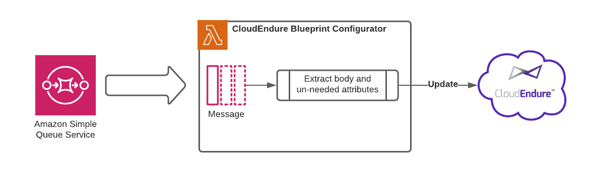

# CloudEndure Blueprint Automation - Configurator


## Description:
The configurator function is part of the solution automating the configuration of blueprints in Cloudendure. This function is used in combination with an SQS queue that provides 

### Workflow


### Dependencies:

| Package | Version |
|:--------|:---------|
| certifi | >=2021.10.8 |
| charset-normalizer | >=2.0.7 |
| cloudendure2 | >=0.0.4 |
| idna | >=3.3 |
| pip | >=21.1.2 |
| requests | >=2.26.0 |
| setuptools | >=57.0.0 |
| urllib3 | >=1.26.7 |
| wheel | >=0.36.2 |

### Inputs

#### Environment Variables
Upon creation of the function via CloudFormation an environment variable with the CloudEndure userApiToken is created in the execution environment.

#### SQS
The configurator accepts SQS messages via the event parameter. The body of the message must adhere to the following format:

```json 
{
    "staticIpAction": "DONT_CREATE",
    "disks": [
        {
            "iops": 0,
            "name": "m:0",
            "throughput": 0,
            "type": "SSD"
        },
        {
            "iops": 0,
            "name": "c:0",
            "throughput": 0,
            "type": "SSD"
        }
    ],
    "runAfterLaunch": true,
    "privateIPAction": "CREATE_NEW",
    "machineName": "EC2AMAZ-1234567",
    "recommendedPrivateIP": "10.0.0.10",
    "recommendedInstanceType": "c4.xlarge",
    "subnetsHostProject": "",
    "byolOnDedicatedInstance": false,
    "placementGroup": "",
    "id": "11ab1cdd-1234-1abc-a123-1a2b3456789c",
    "publicIPAction": "DONT_ALLOCATE",
    "dedicatedHostIdentifier": "AUTO_PLACEMENT",
    "privateIPs": [],
    "staticIp": "",
    "instanceType": "m5.large",
    "tenancy": "SHARED",
    "forceUEFI": false,
    "tags": [
        {
            "key": "TagKey",
            "value": "TagValue"
        }
    ],
    "iamRole": "MyInstanceRoleName",
    "machineId": "a1bc23d4-1ab2-1a2b-12ac-1a2b3cd4e56f",
    "networkInterface": "",
    "securityGroupIDs": [
        "Sg-12345678901234567"
    ],
    "projectName": "CE DR Project",
    "region": "a43ee8c1-878f-4a28-9338-9f99bdd00aaa",
    "projectId": "11ab1cdd-1234-1abc-a123-1a2b3456789c",
    "subnetIDs": [
        "subnet-02290a2699c3e2d95"
    ]
}
```

### Config

|FunctionName                      |Runtime  |Handler                 |CodeSize|Description|Timeout|MemorySize|PackageType|
|----------------------------------|---------|------------------------|--------|-----------|-------|----------|-----------|
|cloudendure-blueprint-configurator|python3.8|function.configurator   |795078  |           |20     |128       |Zip        |

