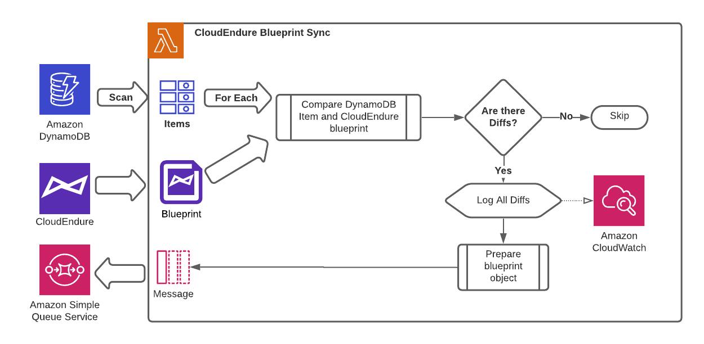

# CloudEndure Blueprint Automation - Sync

## Description:
The updater function is part of the solution automating the configuration of blueprints in Cloudendure. This function is designed to correct any deviations from the preferred blueprint setting in DynamoDB and CloudEndure. This function will periodically check DynamoDB and CloudEndure. If any differences are detected, the function will log the diffs in CloudWatch, and update the CloudEndure blueprint to match.

### Workflow

### Dependencies:

| Package | Version |
|:--|:--|
| boto3 | >=1.19.0 |
| botocore | >=1.21.60 |
| charset-normalizer | >=2.0.7|
| cloudendure2 | >=0.0.4|
| idna | >=3.3|
| jmespath | >=0.10.0 |
| pip | >=21.3 |
| python-dateutil | >=2.8.2 |
| requests | >=2.26.0|
| s3transfer | >=0.5.0 |
| setuptools | >=57.0.0 |
| six | >=1.16.0 |
| urllib3 | >=1.26.7 |
| wheel | >=0.36.2 |

### Inputs

#### Trigger
The sync function is triggered by a CloudWatch event once per day (as of this writing). 

#### Environment Variables
Upon creation of the function via CloudFormation the following environment variables are created in the execution environment:
- userApiToken - Access to CloudEndure API
- QueueURL - Configurator queue url

#### CloudEndure & DynamoDB 
The sync function receives all blueprints from the DynamoDB and CloudEndure. Each blueprint is checked for consistency. If any differences are found the settings form DynamoDB are forwarded to and SQS queue.

### Config
|FunctionName                      |Runtime  |Handler                 |CodeSize|Description|Timeout|MemorySize|PackageType|
|----------------------------------|---------|------------------------|--------|-----------|-------|----------|-----------|
|cloudendure-blueprint-sync        |python3.8|function.check_blueprint|793894  |           |30     |128       |Zip        |

