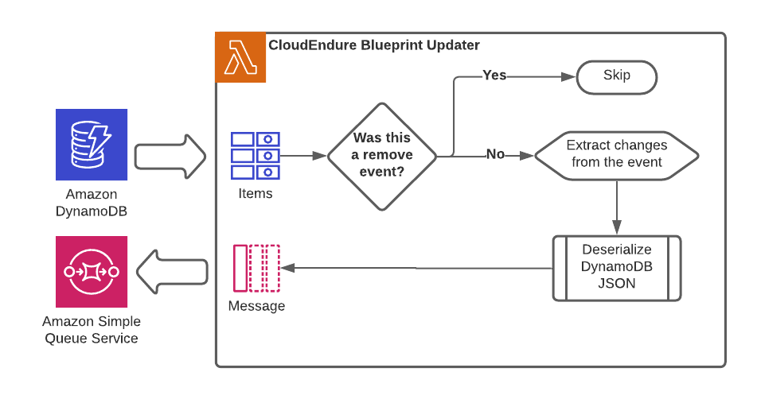

# CloudEndure Blueprint Automation - Updater


## Description:
The updater function is part of the solution automating the configuration of blueprints in Cloudendure. This function is designed to monitor a DynamoDB table stream for insert and update activity. When insert and modify activity is detected, the function processes the event and queues the change in an SQS queue to be processed by another function.

### Workflow


### Dependencies:

| Package | Version |
|:--|:--|
| boto3 | >=1.19.0 |
| botocore | >=1.22.0 |
| jmespath | >=0.10.0 |
| pip | >=21.3 |
| python-dateutil | >=2.8.2 |
| s3transfer | >=0.5.0 |
| setuptools | >=57.0.0 |
| six | >=1.16.0 |
| urllib3 | >=1.26.7 |
| wheel | >=0.36.2 |


### Inputs

#### Environment Variables
Upon creation of the function via CloudFormation an environment variable with the queue_url is created in the execution environment.

#### DynamoDB Stream
The updater function receives all activity from the DynamoDB stream containing the preferred CloudEndure blueprint settings. These settings are forwarded to and SQS queue. 

The DynamoDB stream provides a JSON formated event containing the data before and after the change was made. The data is provided in a marshalled format. A function is included to deserialize data before further processing.


```python 
import boto3
from boto3.dynamodb.types import TypeDeserializer


def dynamo_obj_to_python_obj(dynamo_obj: dict) -> dict:
    deserializer = TypeDeserializer()
    return {
        k: deserializer.deserialize(v)
        for k, v in dynamo_obj.items()
    }
```

### Config
|FunctionName                      |Runtime  |Handler                 |CodeSize|Description|Timeout|MemorySize|PackageType|
|----------------------------------|---------|------------------------|--------|-----------|-------|----------|-----------|
|cloudendure-blueprint-updater     |python3.8|function.updater        |2424    |           |3      |128       |Zip        |


